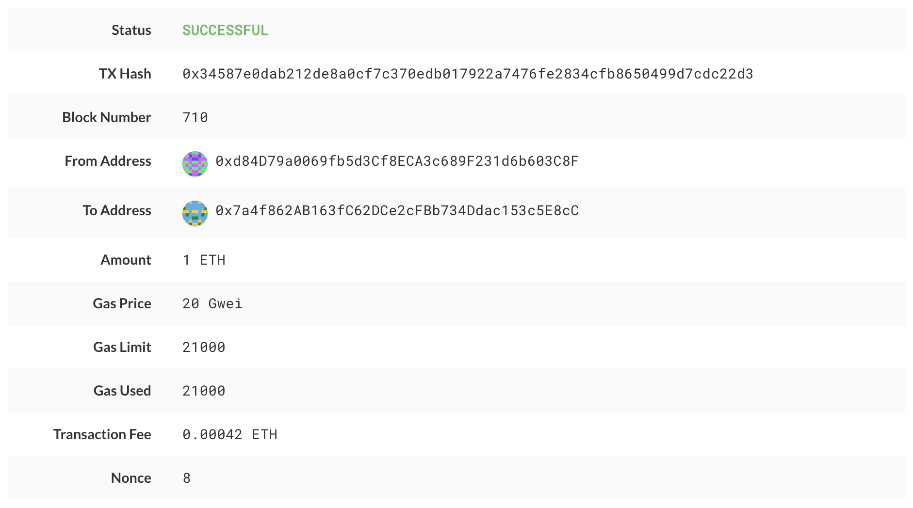

# POA

1. Clone the Blockchain-Tools folder
  * navigate to Blockchain-Tools folder using gitbash 

 2. Initialize the node    
    * Using `geth`, initialize each node with the new `networkname.json`.
        * ./geth --datadir node1 init hw18.json
        * ./geth --datadir node2 init hw18.json
 

3. Now the nodes can be used to begin mining blocks.

    * Run the nodes in separate terminal windows with the commands:
        *  ./geth --datadir node1 --unlock "SEALER_ONE_ADDRESS" --mine --rpc --allow-insecure-unlock
        *  ./geth --datadir node2 --unlock "SEALER_TWO_ADDRESS" --mine --port 30304 --bootnodes "enode://SEALER_ONE_ENODE_ADDRESS@127.0.0.1:30303" --ipcdisable --allow-insecure-unlock
    * **NOTE:** 
    - SEALER_ONE_ADDRESS ('0xd082E3e0648e873D3e27f661e493AD3b0af859d5')
    - SEALER_TWO_ADDRESS ('0xCcF9845ea1c3177cB47cd20ACfFc081BDac78ea1')
    - SEALER_ONE_ENODE_ADDRESS ('enode:// 0xCcF9845ea1c3177cB47cd20ACfFc081BDac78ea1')
   
   

#### Send a test transaction

* Use the MyCrypto GUI wallet to connect to the node with the exposed RPC port.

* You will need to use a custom network, and include the chain ID, and use ETH as the currency.

- note use chain id 1111

* Import the keystore file from the `node1/keystore` directory into MyCrypto. This will import the private key.

* Send a transaction from the `node1` account to the `node2` account.

* Copy the transaction hash and paste it into the "TX Status" section of the app, or click "TX Status" in the popup.

* Screenshot the transaction metadata (status, tx hash, block number, etc) and save it to your Screenshots folder.

* Celebrate, you just created a blockchain and sent a transaction!

